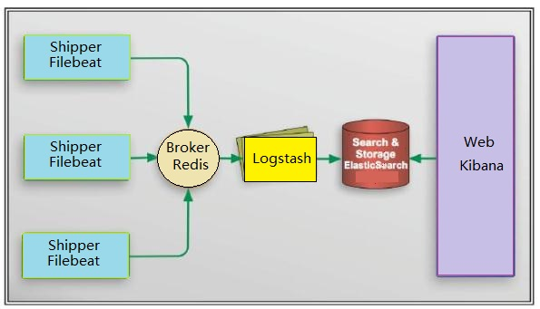

ELK日志分析系统安装

elk架构：



准备工作：

软件及版本信息：

    os: CentOS release 6.9 (Final)
    jdk: jdk-8u144-linux-x64.rpm
    redis: redis-4.0.8.tar.gz
    filebeat: filebeat-6.1.2-x86_64.rpm
    logstash: logstash-6.2.2.rpm
    elasticsearch: elasticsearch-6.1.2.rpm
    kibana: kibana-6.1.3-x86_64.rpm

filebeat在日志端安装，elk集群只安装 redis,logstash,elasticsearch和kibana,其中elasticsearch为集群安装

机器配置：

    node1  172.20.20.182    6cpu  12G
    node2  172.20.20.183    6cpu  12G
    node3  172.20.20.184    6cpu  12G

### 1 安装jdk,rpm包安装，然后配置环境变量 ###
``` shell 
# yum localinstall -y jdk-8u144-linux-x64.rpm
```
环境变量配置：vim /etc/profile
``` shell
###### jdk1.8 ######
JAVA_HOME=/usr/java/jdk1.8.0_144
JRE_HOME=/usr/java/jdk1.8.0_144/jre
PATH=$PATH:$JAVA_HOME/bin:$JRE_HOME/bin
CLASSPATH=.:$JAVA_HOME/lib/dt.jar:$JAVA_HOME/lib/tools.jar:$JRE_HOME/lib
export JAVA_HOME JRE_HOME PATH CLASSPATH
```

### 2 redis安装:编译安装 ###
```shell
# yum install tcl
# tar zxf redis-4.0.8.tar.gz
# cd redis-4.0.8
# make MALLOC=libc 
# make test
# make install PREFIX=/usr/local/redis
```

redis配置文件：vim /etc/redis/redis.conf
```shell
bind 10.0.52.6 127.0.0.1
protected-mode yes
port 6379
tcp-backlog 511
timeout 0
tcp-keepalive 300
daemonize yes
supervised no
pidfile /var/run/redis_6379.pid
#requirepass ****
loglevel notice
logfile ""
databases 16
always-show-logo yes
save 900 1
save 300 10
save 60 10000
stop-writes-on-bgsave-error yes
rdbcompression yes
rdbchecksum yes
dbfilename dump.rdb
dir /data/redis_db/
slave-serve-stale-data yes
slave-read-only yes
repl-diskless-sync no
repl-diskless-sync-delay 5
repl-disable-tcp-nodelay no
slave-priority 100
lazyfree-lazy-eviction no
lazyfree-lazy-expire no
lazyfree-lazy-server-del no
slave-lazy-flush no
appendonly no
appendfilename "appendonly.aof"
appendfsync everysec
no-appendfsync-on-rewrite no
auto-aof-rewrite-percentage 100
auto-aof-rewrite-min-size 64mb
aof-load-truncated yes
aof-use-rdb-preamble no
lua-time-limit 5000
slowlog-log-slower-than 10000
slowlog-max-len 128
latency-monitor-threshold 0
notify-keyspace-events ""
hash-max-ziplist-entries 512
hash-max-ziplist-value 64
list-max-ziplist-size -2
list-compress-depth 0
set-max-intset-entries 512
zset-max-ziplist-entries 128
zset-max-ziplist-value 64
hll-sparse-max-bytes 3000
activerehashing yes
client-output-buffer-limit normal 0 0 0
client-output-buffer-limit slave 256mb 64mb 60
client-output-buffer-limit pubsub 32mb 8mb 60
hz 10
aof-rewrite-incremental-fsync yes
```

注意： 

    bind                    绑定本地ip和回环ip
    protected-mode yes      开启保护模式
    port 6379               端口为6379
    daemonize yes           守护模式开启
    pidfile /usr/local/redis/redis.pid          指定pid文件路径和文件名
    logfile "/usr/local/redis/redis.log"        指定日志文件路径和文件名
    dbfilename redis.rdb                        指定数据文件RDB文件名
    dir /usr/local/redis/                       指定数据文件RDB文件的存放路径
    requirepass  xxx                            设置访问密码

启动redis:
```shell 
# /usr/local/redis/bin/redis-server /etc/redis/redis.conf
```

### 3 安装logstash ###
rpm包安装logstash-6.2.2.rpm
``` shell 
# yum localinstall -y logstash-6.2.2.rpm
```
注意： rpm包安装后还要将/etc/logstash软链接到 /usr/share/logstash/conf
```shell
# ln -s /etc/logstash /usr/share/logstash/conf
```

logstash 配置文件：vim /etc/logstash/conf.d/logstashd.yml
``` yaml
input {
    beats {
        #type => "posp_log"
        port => 5044
    }

    redis {
        host => "172.20.20.182"
        port => 6379
        data_type => "list"
        key => "logstash:redis"
        threads => 1
    }
}
 
filter {
    dissect {
        mapping => { "message" => "[%{log_time}][%{pid}][%{postion}][%{log_level}][%{log_id}]%{content}" }
    }
    date {
        match => ["log_time", "yyyy-MM-dd HH:mm:ss SSSSSS"]
    }
}
 
output {
    if [type] == "mpos_java_transaction" {
        elasticsearch {
            hosts => ["10.0.52.4:9200"]
            index => "mpos_log_transaction_%{+YYYY.MM.dd}"
            #document_type => "mpos_log_%{type}"
            flush_size => 500
            idle_flush_time => 1
            sniffing => true
            template_overwrite => true
        }
    } else if [type] == "posp_verity" {
        elasticsearch {
            hosts => ["10.0.52.4:9200"]
            index => "posp_verity_%{+YYYY.MM.dd}"
            #document_type => "%{type}"
            flush_size => 500
            idle_flush_time => 1
            sniffing => true
            template_overwrite => true
        }
    } else {
        elasticsearch {
            hosts => ["10.0.52.4:9200"]
            index => "posp_log_%{type}_%{+YYYY.MM.dd}"
            #document_type => "%{type}"
            flush_size => 500
            idle_flush_time => 1
            sniffing => true
            template_overwrite => true
        }
    }
}
 
 
 
output {
    elasticsearch {
        hosts => ["172.20.20.182:9200"]
                index => "posp_log_%{type}_%{+YYYY.MM.dd}"
                #document_type => "%{type}"
                flush_size => 500
                idle_flush_time => 1
                sniffing => true
                template_overwrite => true
    }
}
```

logstash 启动：
```
# sudo -u logstash /usr/share/logstash/bin/logstash -f /etc/logstash/conf.d/logstashd.yml &
```

当然，这种启动方法不方便管理，最好使用supervisor管理起来
``` shell
# yum -y install epel-release
# yum -y install supervisord --enablerepo=epel
```

supervisor配置：
```conf
[program:logstash]
environment=LS_HEAP_SIZE=5000m
directory = /usr/share/logstash/bin
command = /usr/share/logstash/bin/logstash -f /etc/logstash/conf.d/logstashd.yml
autostart = true
startsecs = 5
autorestart = true
startretries = 3
user = logstash
redirect_stderr = true
stdout_logfile_maxbytes = 20MB
stdout_logfile_backups = 20
stdout_logfile = tailf /var/log/logstash/logstash.log
```

### 4 elasticsearch集群安装 ###
```shell
# rpm -ivh elasticsearch-6.1.2.rpm
```

修改系统参数：
```
vim /etc/security/limits.conf

*           soft   nofile       65536
*           hard   nofile       131072
*           soft   nproc        60000
*           hard   nproc        60000
```
说明：

    nofile      打开文件的最大数目
    noproc      进程的最大数目

对于centos7使用systemd管理服务的，可以直接在elasticsearch.service文件修改：
```
LimitNOFILE=131072
LimitNPROC=4096
```

创建目录和更改目录权限
```shell
# mkdir -p /data/elasticsearchdata/{data,logs}
# chown -R elasticsearch:elasticsearch /data/elasticsearchdata/
```


es配置文件：
vim /etc/elasticsearch/elasticsearch.yml
```yaml
#节点1
# grep -iv '#' /etc/elasticsearch/elasticsearch.yml | grep -iv '^$'
cluster.name: el-search
node.name: es-node-01
node.master: true
node.attr.rack: r1
path.data: /data/elasticsearchdata/data
path.logs: /data/elasticsearchdata/logs
bootstrap.memory_lock: false
bootstrap.system_call_filter: false
network.host: 172.20.20.182
transport.tcp.port: 9300
http.port: 9200
http.cors.enabled: true
http.cors.allow-origin: "*"
discovery.zen.ping.unicast.hosts: ["172.20.20.182", "172.20.20.183","172.20.20.184"]
discovery.zen.minimum_master_nodes: 2
gateway.recover_after_nodes: 2
gateway.expected_nodes: 3
gateway.recover_after_time: 5m


# 节点2
# grep -iv '#' /etc/elasticsearch/elasticsearch.yml | grep -iv '^$'
cluster.name: el-search
node.name: es-node-02
node.master: true
node.attr.rack: r1
path.data: /data/elasticsearchdata/data
path.logs: /data/elasticsearchdata/logs
bootstrap.memory_lock: false
bootstrap.system_call_filter: false
network.host: 172.20.20.183
transport.tcp.port: 9300
http.port: 9200
http.cors.enabled: true
http.cors.allow-origin: "*"
discovery.zen.ping.unicast.hosts: ["172.20.20.182", "172.20.20.183","172.20.20.184"]
discovery.zen.minimum_master_nodes: 2
gateway.recover_after_nodes: 2
gateway.expected_nodes: 3
gateway.recover_after_time: 5m

# 节点3
# grep -iv '#' /etc/elasticsearch/elasticsearch.yml | grep -iv '^$'
cluster.name: el-search
node.name: es-node-03
node.master: true
node.attr.rack: r1
path.data: /data/elasticsearchdata/data
path.logs: /data/elasticsearchdata/logs
bootstrap.memory_lock: false
bootstrap.system_call_filter: false
network.host: 172.20.20.184
transport.tcp.port: 9300
http.port: 9200
http.cors.enabled: true
http.cors.allow-origin: "*"
discovery.zen.ping.unicast.hosts: ["172.20.20.182", "172.20.20.183","172.20.20.184"]
discovery.zen.minimum_master_nodes: 2
gateway.recover_after_nodes: 2
gateway.expected_nodes: 3
gateway.recover_after_time: 5m
```
注意配置只有两个不同点：

    node.name:
    network.host:

设置堆内存大小：
```shell
export ES_HEAP_SIZE=10g
```
启动：
```shell
# systemctl start elasticsearch.service
```

### 5 kibana 安装 ###
```shell
# rpm -ivh kibana-6.1.3-x86_64.rpm
```

配置文件：vim /etc/kibana/kibana.yml
```yaml
server.port: 5601
server.host: "172.20.20.182"
server.name: "es-kibana"
elasticsearch.url: "http://192.168.1.42:9200"
```
启动：
```shell
# systemctl start kibana
```

### 6 filebeat 安装 ### 
```shell 
# rpm -ivh filebeat-6.1.2-x86_64.rpm
```

配置文件：
``` yaml
filebeat.prospectors:
- input_type: log
  paths:
    - /data/mpos/xmpos*.log
  multiline.pattern: ^\[
  multiline.negate: true
  multiline.match: after
  document_type: mpos_java_transaction
  tags: mpos_java
  
- input_type: log
  paths:
    - /data/java_service/logs/manage/*.log
  multiline.pattern: ^\[
  multiline.negate: true
  multiline.match: after
  document_type: management_service
  tags: posp_java
 
#output.logstash:
#  hosts: ["10.0.52.4:5044"]

output.redis:
  enable: true
  hosts: "10.0.52.6"
  port: 6379
  key: "logstash:redis"
  datatype: list
```

-------
查看集群健康状态：
```shell
# curl -XGET http://172.20.20.183:9200/_cat/health?v
```

查看所有索引
```shell
# curl -XGET http://172.20.20.183:9200/_cat/indices?v
```

删除索引
```shell 
# curl -XDELETE 'http://localhost:9200/filebeat-2016.12.28'
# curl -XDELETE  'http://127.0.0.1:9200/*2017.*'
```


